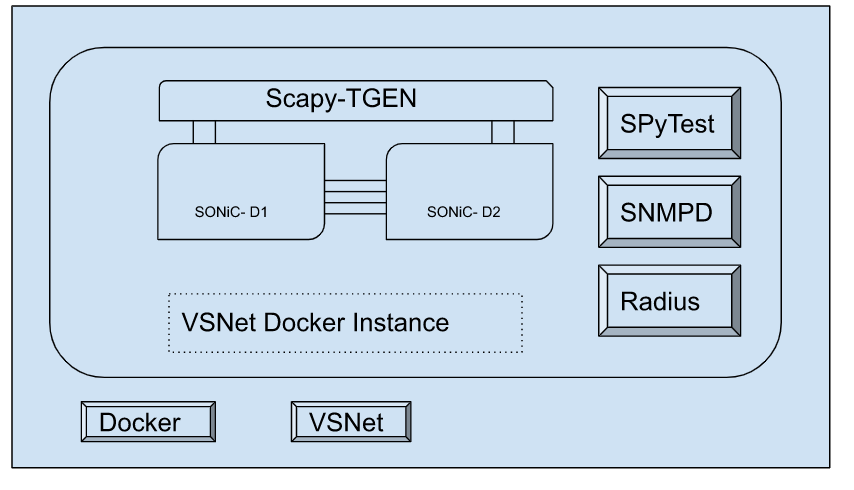

# VSNet - Virtual SONiC Network Helper

_Rev v0.1_

- [Revision](#revision)
- [Scope](#scope)
- [Definitions/Abbreviations](#definitionsabbreviations)
- [Overview](#overview)
- [Requirements](#requirements)
- [High-Level Design](#high-level-design)
- [Server Requirements](#server-requirements)
- [Open/Action Items](#openaction-items)

## Revision

Rev  | RevDate    | Author(s)   | Change Description
---- | ---------- | ----------- | ------------------
v0.1 | 05/05/2023 | Broadcom    | Initial Version

## Scope

This document describes the high-level design for VSNet helper.

## Definitions/Abbreviations

* **KVM** Kernel-based virtual machine
* **OVS** Open vSwitch
* **TGEN** Traffic Generator
* **SPyTest** SONiC Test Framework available in somic-mgmt repository

## Overview

VSNet is a helper utility to create network of virtual SONiC instances in a contained environment and inter connect them in in the specified topology.
It is expected to be used in a server/VM where docker daemon is running.

Historically SONiC virtual instances have been run inside VMs and inter connected using Linux Bridges, which requires powerful servers and the scaling is always a challenge.

## Requirements

Functional requirements:
* should provide easy and concise way to specify the topology
* should depend on very few dependencies on host system
* should provide option to execute SPyTest test modules
* should support both VM and container based virtual instances

## High-Level Design

It first creates a parent container instance within which the needed number of SONiC virtual VM/container instances are created along with the required links between them.
It also instantiates service (SCAPY-TGEN) to emulate hosts and send traffic.
More details on the Traffic Generation can be found [here.](https://github.com/sonic-net/sonic-mgmt/blob/master/spytest/Doc/intro.md#traffic-generation)

By default VSNet creates VM instances which can be changed using --platform docker argument.
In case of VM platform type, VSNet starts KVM instances, OVS bridge and add the interfaces along with needed open-flow rules to provide inter connections.
When the platform is not VM, the supplied image is converted into container image and volume in the parent container.
As long as there are no kernel patch dependencies this method of running SONiC in a container should give us good scale.

All the options supported are listed in below --help.

    usage: vsnet [-h] [--noop] [--name NAME] [--platform {vm,docker}] [--host HOST]
                 [--topology TOPOLOGY [TOPOLOGY ...]] [--cpu CPU] [--mem MEM]
                 [--lanes LANES] [--share SHARE] [--image IMAGE] [--repo REPO]
                 [--run-args RUN_ARGS [RUN_ARGS ...]]
                 {build,remove,topo,test} [{build,remove,topo,test} ...]

    Virtual SONiC Network Helper.

    positional arguments:
      {build,remove,topo,test}  operation(s) to be performed.

    optional arguments:
      -h, --help                show this help message and exit
      --noop                    No operation, can be used to terminate multiple value arguments.
      --name NAME               Name of the network instance. default: vsnet
      --platform {vm,docker}    Underlying platform type to run SONiC. default: vm
      --host HOST               Docker host to run. default: <DOCKER_HOST>|unix:///var/run/docker.sock
      --topology TOPOLOGY [TOPOLOGY ...]
                                default: ['POD:V D1D2:6 D1D3:4 D1D4:4 D2D3:4 D2D4:4 D3D4:6 T1D1:4 T1D2:4 T1D3:4 T1D4:4']
      --cpu CPU                 Maximum CPU cores per SONiC instance. default: 4
      --mem MEM                 Maximum memory in GB per SONiC instance. default: 8
      --lanes LANES             Number of interface lanes in SONiC. default: 4
      --share SHARE             Path in the host to store results and temporary files. default: /data
      --image IMAGE             SONiC Build Path on the host. default: <share>/images/sonic-vs.img
      --repo REPO               SPyTest repo path in host. default: <share>/sonic-mgmt/spytest/
      --run-args RUN_ARGS [RUN_ARGS ...]
                                SPyTest run arguments.

The sample invocation is as given below.

    vsnet build test --topology POD:A D1D2:4 T1D1:2 T1D2:2 --image /data/images/sonic-vs.img --share /data/sandbox
              --repo /data/sonic-mgmt/spytest -- <SPyTest run arguments>

The 'build' argument indicates to create docker image to be used in subsequent operations
and 'test' argument is to trigger the SPyTest using the run arguments provided.
The topology specified indicates the need for two devices with names A1, A2 to be connected with 4 links and each of the devices are connected to traffic generator with 2 links.
The POD:A indicates the prefix to be used for the devices and 'T1' here indicates the Traffic Generator.
Though we can't support multiple traffic generators in one topology it is kept as T1 to be consistent with device naming.

The other possible operations are 'remove' to destroy the parent container along with the topology inside and
'topo' to create the topology without starting SPyTest run.

More detail on SPyTest can be found [here.](https://github.com/sonic-net/sonic-mgmt/blob/master/spytest/Doc/intro.md)
All the necessary environment for the SPyTest is contained within the parent container.

## Server Requirements

* docker daemon
* openvswitch-switch package
* 32 GB RAM
* 16 vCPU

## Open/Action Items

* Support for other NOS Images
* Support for different SONiC images for different devices
* Support for multiple VSNet instances across docker servers

